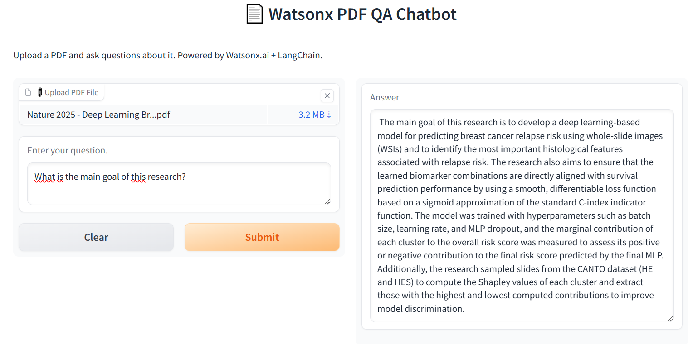

# Watsonx-RAG-Assistant 📄  
An AI-powered PDF Question Answering assistant using IBM Watsonx.ai, LangChain, and Gradio.

## Overview

This project is a Retrieval-Augmented Generation (RAG) assistant built with [LangChain](https://www.langchain.com/), using IBM's Watsonx foundation models to understand and answer user queries based on uploaded PDF documents. The assistant is equipped to read scientific papers or business documents and provide concise, contextual answers.

This project was built as part of the Coursera course: **[Generative AI Applications with RAG and LangChain](https://www.coursera.org/learn/project-generative-ai-applications-with-rag-and-langchain)** from the specialization **[Generative AI Engineering with LLMs](https://www.coursera.org/specializations/generative-ai-engineering-with-llms)**.


## Features

- ✅ Load and parse PDF documents
- ✅ Split text into manageable chunks
- ✅ Embed documents with IBM Watsonx embedding model
- ✅ Store chunks in a Chroma vector store
- ✅ Query a LangChain retriever backed by IBM Watsonx LLM
- ✅ User-friendly interface with Gradio

---

## Tech Stack

| Tool          | Description                                                                             |
|---------------|-----------------------------------------------------------------------------------------|
| **Watsonx.ai**| [IBM's foundation models](https://www.ibm.com/products/watsonx) for LLM and embeddings  |
| **LangChain** | RAG pipeline and chaining logic                                                         |
| **ChromaDB**  | Vector store for document embeddings                                                    |
| **Gradio**    | Frontend UI for document upload & chat                                                  |
| **Python**    | Backend language                                                                        |

---

## Use Case

This assistant is ideal for:
- 📚 Researchers summarizing long academic papers
- 💼 Business professionals analyzing contracts or reports
- 📄 Anyone needing quick insights from large documents

---

## How to Run

1. **Clone the repo**  

```bash
git clone https://github.com/your-username/watsonx-rag-assistant.git
cd watsonx-rag-assistant
```

2. **Install dependencies**  

```bash
pip install -r requirements.txt
```

3. **Set your Watsonx credentials**  

```bash
export WATSONX_APIKEY=your_ibm_api_key
export WATSONX_URL=https://<region>.ml.cloud.ibm.com
export WATSONX_PROJECT_ID=your_project_id
```
Alternatively, you can store them in a ```.env``` file at the root of your project:

```bash
WATSONX_APIKEY=your_ibm_api_key
WATSONX_URL=https://<region>.ml.cloud.ibm.com
WATSONX_PROJECT_ID=your_project_id
```

4. **Run the app**

```bash
python main.py
```

Once running, Gradio will open either:

A local URL like http://127.0.0.1:7860 (for testing on your machine), or a public shareable URL (if ```share=True``` is set in ```launch()```).

## Demo

Here’s a quick look at the application:

[](./QA_bot.png)

## Credits

Created by Shiraze Chebira as part of the capstone project for the Coursera specialization: 
**Generative AI Engineering with LLMs**.

## License
This project is open-source and released under the MIT License.
